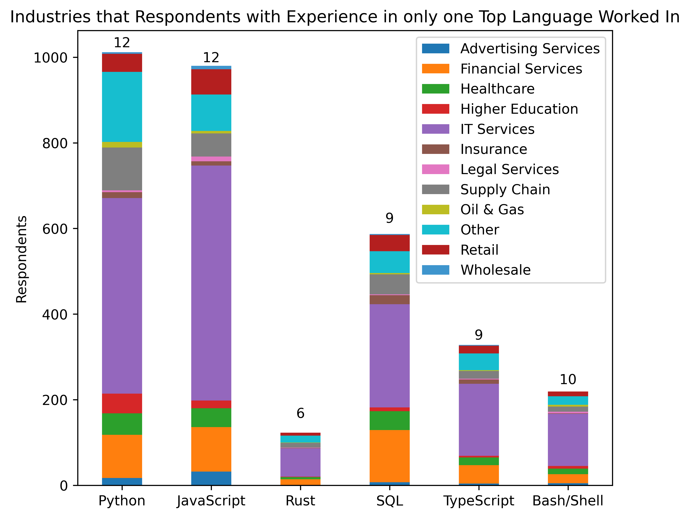
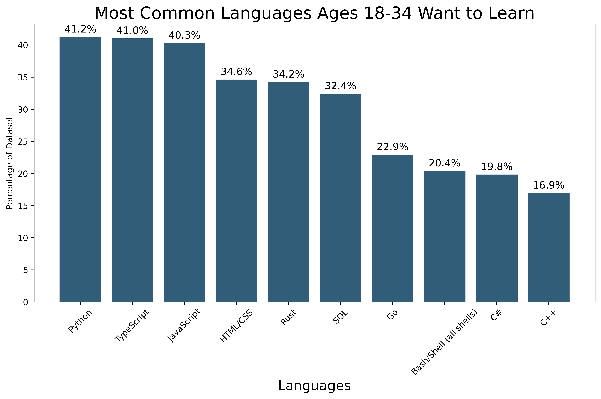
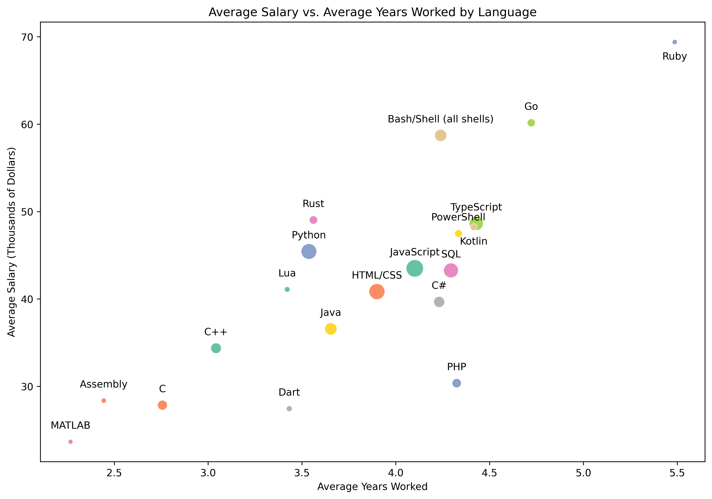
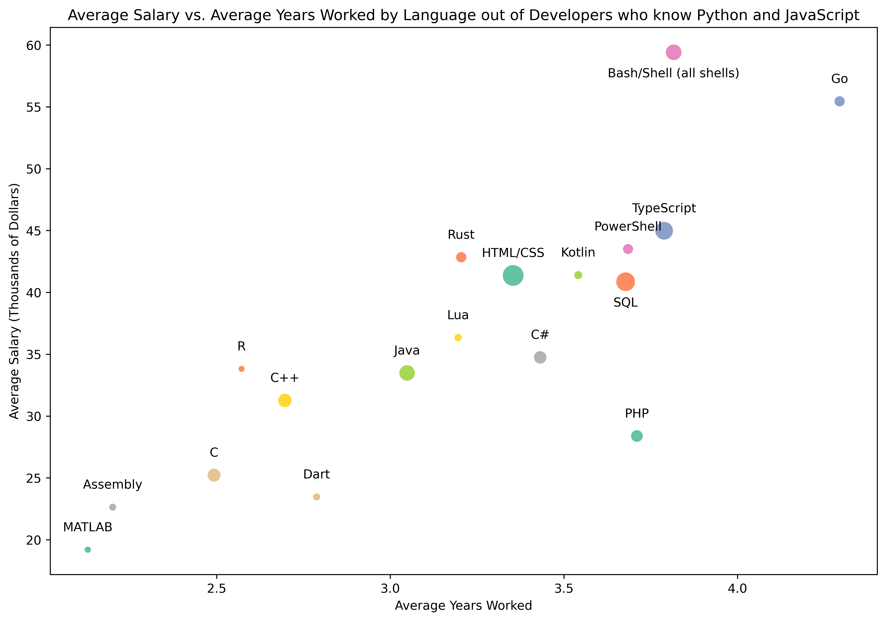

# ASAFallDataChallenge
This repository contains the code that our team used for the American Statistical Association's Fall Data Challenge. Our team used Python, Pandas, and Seaborn to create these graphs looking at specific parts of our data.

These are the graphs we made:

